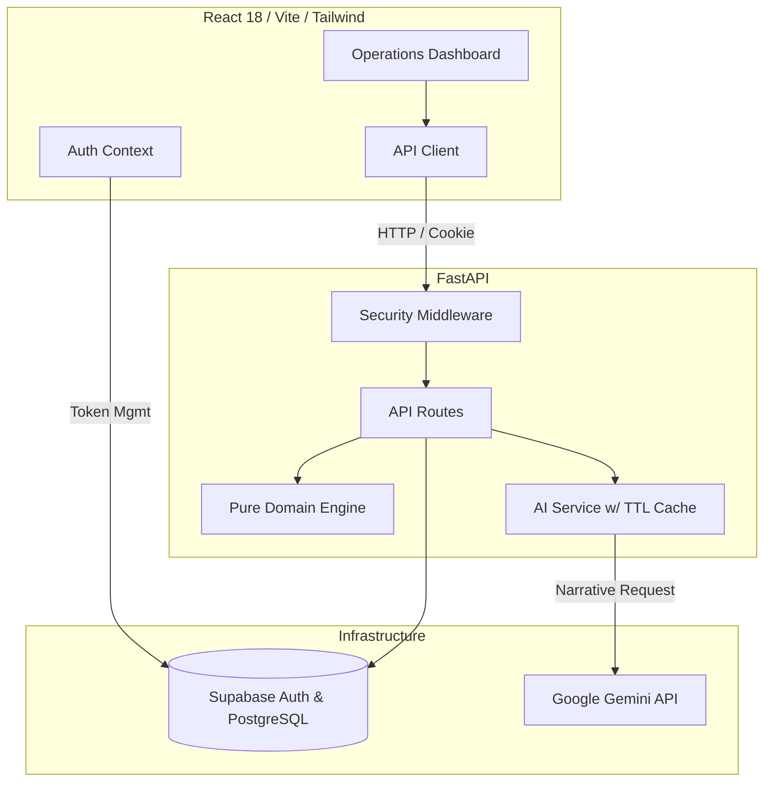

<div align="center">
  
  <h1>StadiumIQ</h1>
  <p><strong>FIFA World Cup 2026™ Stadium Operations Command Center</strong></p>
</div>

<p align="center">
  <a href="https://github.com/Harshit-925/StadiumIQ/actions/workflows/ci.yml">
    
  </a>
  
  
  <a href="https://github.com/Harshit-925/StadiumIQ/blob/main/LICENSE">
    
  </a>
  
  
</p>

<p align="center">
  <strong>🚀 Live Demo: <a href="https://stadium-iq-eight.vercel.app/">https://stadium-iq-eight.vercel.app/</a></strong><br/>
  <em>(Note: The free-tier backend sleeps after inactivity. The first request may take 30-60 seconds to cold-start.)</em>
</p>

---

## Chosen Vertical

**Operational Intelligence & Real-time Decision Support for Venue Staff.**

We chose this vertical because providing venue directors with immediate, actionable data is the most critical component of stadium operations. Our solution centers entirely on the venue operations director. It utilizes a robust deterministic engine to assess crowd safety, accessibility, and sustainability, and layers Generative AI on top to produce instantaneous executive briefings. While multilingual fan assistance, accessibility compliance, and sustainability tracking are full-featured modules, they are positioned as supporting pillars that ultimately feed into this central Operational Intelligence dashboard.

## Approach & Logic

StadiumIQ employs a **deterministic-engine-first** design. The core calculations—such as real-time crowd density (pax/m²), egress times (via NFPA 101 formulas), and ADA compliance ratios—are strictly deterministic and evaluated within `calculator.py`. 

Generative AI is layered on top purely for **narration and translation**, rather than driving the numerical assessments. This architectural choice ensures absolute operational reliability. If the AI service experiences an outage, high latency, or rate-limiting, the system falls back gracefully, providing the operator with raw, un-narrated engine data without compromising life-safety monitoring.

## How It Works

1. **Data Ingestion:** Venue staff log into the command center, which pulls live (simulated) zone capacity data for the selected stadium.
2. **Deterministic Analysis:** The Crowd Safety Engine processes this data to compute density heatmaps, evacuation times, accessibility seating ratios, and waste diversion metrics.
3. **AI Narration:** The AI Narration Layer (powered by Google Gemini) translates these numerical evaluations into a clear, conversational executive summary tailored for rapid consumption by the venue director.
4. **Multilingual Support:** As a supplementary feature, a public-facing fan assistant answers inquiries in multiple languages, utilizing the same deterministic engine outputs as its ground truth to ensure consistency between operator and fan data.

## Assumptions Made

- **Simulated Data Feed:** Zone-level crowd counts are simulated/mocked via the UI in the absence of live turnstile integrations or computer vision camera feeds.
- **Stadium Specifications:** Venue capacity, exit widths, and wheelchair seating figures are sourced from general public stadium specifications rather than official, classified FIFA venue documents.
- **AI Availability:** Google Gemini API key availability is assumed for full functionality; however, deterministic fallback logic is in place for outages.
- **ADA Data:** Wheelchair seating figures are illustrative estimates per venue, not formally audited ADA compliance data.

## Documentation

For deep-dives into the engineering standards and compliance matrices behind this project, refer to the following documents:
- [Security Architecture](SECURITY_ARCHITECTURE.md)
- [Testing Strategy](TESTING_STRATEGY.md)
- [Accessibility Compliance Report](ACCESSIBILITY_COMPLIANCE_REPORT.md)
- [Code Quality Standards](CODE_QUALITY_STANDARDS.md)
- [Performance Report](PERFORMANCE_REPORT.md)

## Architecture

```text
┌────────────────────────────────────────────────────────┐
│                      FRONTEND                          │
│  React 18 + TypeScript Strict + Vite + TailwindCSS     │
│  State: Zustand | Charts: Recharts | 3D: Three.js      │
└──────────────────────────┬─────────────────────────────┘
                           │ HTTPS / REST API
┌──────────────────────────▼─────────────────────────────┐
│                      BACKEND                           │
│  FastAPI + Python 3.11 + Pydantic v2                   │
│  Engine: Pure Functions | AI: Google GenAI (Gemini)    │
└──────────────────────────┬─────────────────────────────┘
                           │
┌──────────────────────────▼─────────────────────────────┐
│                   INFRASTRUCTURE                       │
│  Auth & DB: Supabase (PostgreSQL)                      │
└────────────────────────────────────────────────────────┘
```



## Features

| Category | Feature | Description |
|---|---|---|
| **Crowd Safety Engine** | Real-time Density Heatmaps | Calculates pax/m² across zones to trigger dynamic safe/moderate/warning/critical states. |
| **Evacuation Modeling** | Egress Time Projection | Uses NFPA 101 formulas based on dynamic capacities and exit widths to verify the 8-minute standard. |
| **Accessibility Compliance** | ADA Seat Verification | Monitors compliance of wheelchair-accessible seating inventory against the 1% ADA mandate. |
| **Sustainability Tracking** | Waste Diversion Analytics | Tracks and evaluates diversion rates against the World Cup 2026 sustainability target of 90%. |
| **Multilingual Fan Assistant** | AI Contextual Q&A | An unauthenticated, rate-limited portal allowing fans to query stadium rules and facilities in multiple languages. |
| **AI Narration Layer** | Automatic Operator Briefings | Converts numerical engine data into conversational executive summaries for stadium directors. |
| **Security** | Standard JWT Auth | Uses standard Supabase session management backed by `localStorage` for fast, scalable auth state. |
| **Testing & CI** | Security Audits & Coverage | Features strict CI/CD with `pip-audit`, `npm audit`, `mypy --strict`, and boundary testing. |

## Data Entities

| Entity | Primary Role | Key Fields |
|---|---|---|
| `auth.users` (Supabase) | Operator authentication | `id`, `email` |
| `venues` | Core static stadium data | `id`, `name`, `capacity`, `exit_width_m`, `wheelchair_seats` |
| `analysis_results` | Snapshot of engine evaluations | `venue_id`, `crowd_score`, `readiness_grade`, `timestamp` |
| `fan_queries` (Logs) | Ephemeral AI query tracking | `query_text`, `language`, `source`, `fallback_used` |

## API Documentation

| Category | Method | Endpoint | Description | Auth Required |
|---|---|---|---|:---:|
| **Health** | `GET` | `/api/health` | Service connectivity check (Backend + Supabase). | ❌ |
| **Analysis** | `POST` | `/api/analyze` | Runs pure-function engine and generates AI insights. Saves results if logged in. | ❌ |
| **Fan Assistance** | `POST` | `/api/fan-assist` | Multilingual AI stadium guide with venue context. | ❌ |

## Calculation Methodology

Formulas from the core domain engine (`calculator.py`):

| Metric | Formula / Calculation | Threshold / Target |
|---|---|---|
| **Crowd Density** | `spectator_count / zone_area_sqm` | Safe: < 2.0 pax/m², Critical: > 4.5 pax/m² |
| **Evacuation Time** | `(capacity / (exit_width_m * 82)) + 2.0` | Max: 8.0 minutes (NFPA 101 proxy) |
| **ADA Compliance** | `wheelchair_seats / total_capacity` | Min: 1.0% (0.01) |
| **Waste Diversion** | `(recycled_kg / total_waste_kg) * 100` | Target: 90% |

## Security Features

*   **No Hand-Rolled Auth**: Delegated completely to Supabase's robust GoTrue identity system.
*   **Stateless JWT Verification**: Backend performs zero-network JWT validation using the Supabase JWT Secret.
*   **Dual Rate Limiting**:
    *   `/api/analyze` (Authenticated): 10 requests per minute by token prefix.
    *   `/api/fan-assist` (Public/Anonymous): 5 requests per minute by IP address.
*   **Automated Dependency Audits**: CI pipeline integrates `pip-audit` and `npm audit --audit-level=high` to immediately flag vulnerabilities.
*   **Secrets Scanning**: `gitleaks` configured in CI to prevent accidental credential exposure.

## Accessibility Features

*   **Never-Color-Alone Indicators**: All status markers (safe, critical, etc.) use descriptive text and distinct icons alongside their color states.
*   **Keyboard Navigation**: Full tab-index support, focus rings, and skip links available across operator dashboards.
*   **Aria-Live Regions**: Real-time alerts and dynamic changes (like AI text generation) are announced to screen readers.
*   **Reduced-Motion Support**: Continuous animations like the Stadium Pulse automatically detect system preferences and disable animation.
*   **Labeled Form Inputs**: Every input element provides an explicit, associated `<label>` for assistive tech.

## Getting Started

### Prerequisites
*   Node.js 20+
*   Python 3.11+
*   Docker & Docker Compose

### Installation
```bash
# 1. Clone the repository
git clone https://github.com/Harshit-925/StadiumIQ.git
cd StadiumIQ

# 2. Set up the environment variables
cp .env.example .env

# 3. Backend Setup
cd backend
pip install -r requirements.txt
uvicorn app.main:create_app --reload

# 4. Frontend Setup
cd frontend
npm install
npm run dev
```

The application will be available at:
*   Frontend: `http://localhost:5173`
*   Backend API: `http://localhost:8000/api`

### Environment Variables
Configure your `.env` file in the project root:

```env
GEMINI_API_KEY=your_key_here
ENVIRONMENT=development
USE_AI=true
RATE_LIMIT_STORAGE_URI=memory://
SUPABASE_URL=https://your-project.supabase.co
SUPABASE_SERVICE_ROLE_KEY=your_service_role_key
SUPABASE_JWT_SECRET=your_jwt_secret
```

## Testing

Run the testing suites to verify domain engine behavior, auth token boundaries, and UI accessibility:

```bash
# Backend (Pytest + Coverage)
cd backend
pip install -r requirements.txt
pytest --cov=app

# Frontend (Vitest + React Testing Library)
cd frontend
npm ci --ignore-scripts
npm run test
```

**Coverage Areas:**
*   Pure deterministic edge-case testing for the `calculator.py` operations engine.
*   Stateless JWT validation and Supabase background task testing.
*   AI Service fallback simulations when Google GenAI is unavailable.
*   UI rendering states, accessibility properties, and protected layout routing.

## Project Structure

```text
C:.
├───backend
│   ├───app
│   │   ├───core
│   │   ├───engine
│   │   ├───models
│   │   ├───routes
│   │   └───services
│   ├───tests
│   ├───requirements.txt
│   └───pyproject.toml
├───frontend
│   ├───src
│   │   ├───components
│   │   ├───store
│   │   └───types
│   ├───tests
│   ├───package.json
│   ├───tailwind.config.js
│   └───eslint.config.js
└───pb_migrations
```

## License

This project is licensed under the [MIT License](LICENSE).

---

A unified digital command layer ensuring safe, efficient, and accessible stadium operations.
