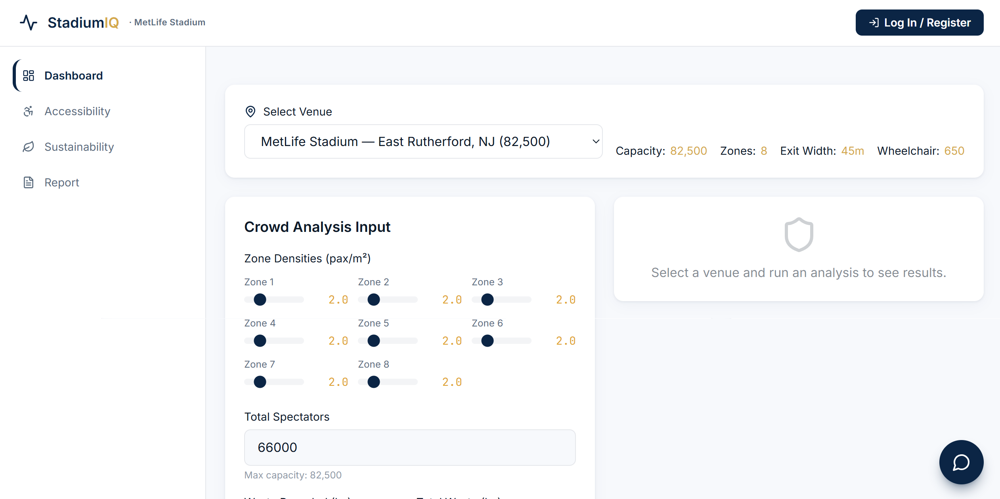
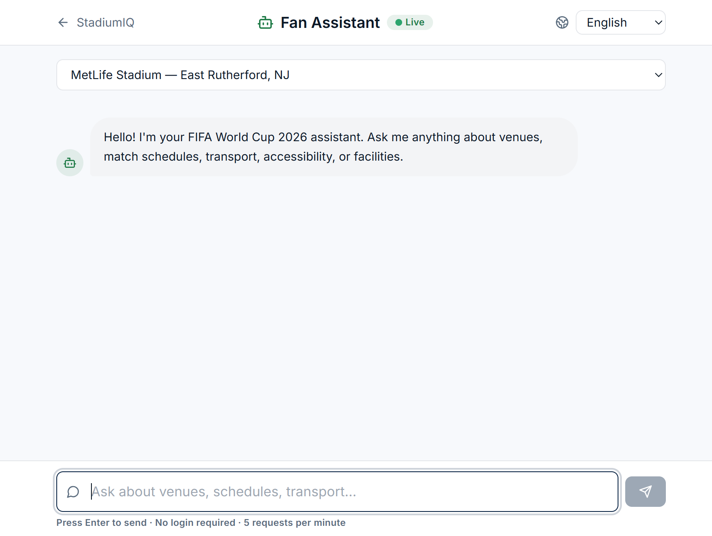
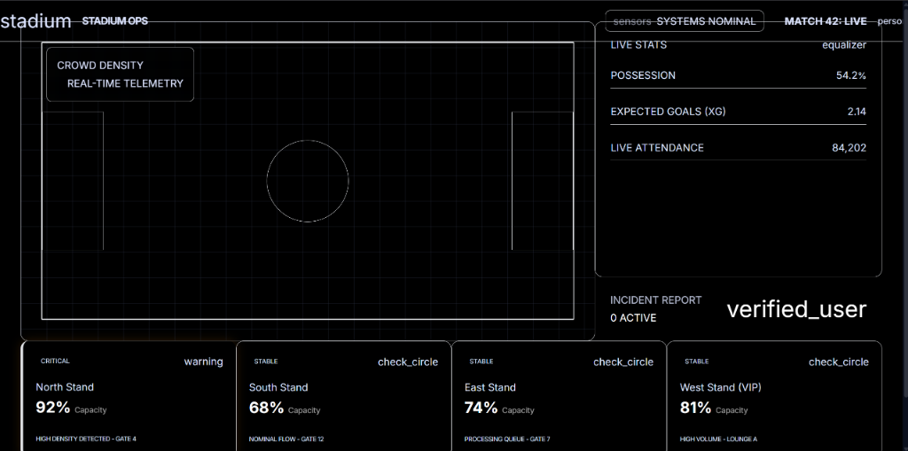
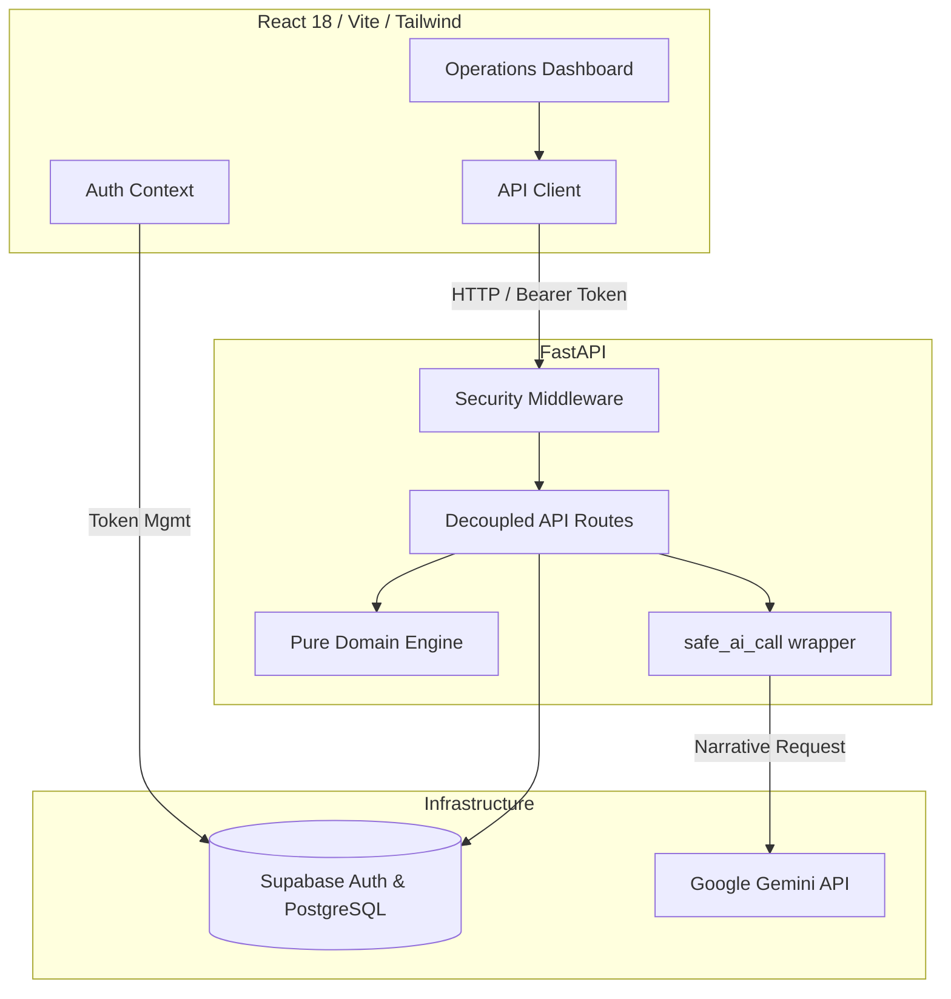

<div align="center">
  
  <h1>StadiumIQ</h1>
  <p><strong>FIFA World Cup 2026™ Stadium Operations Command Center</strong></p>
</div>

<p align="center">
  <a href="https://github.com/Harshit-925/StadiumIQ/actions/workflows/ci.yml">
    
  </a>
  
  
  <a href="https://github.com/Harshit-925/StadiumIQ/blob/main/LICENSE">
    
  </a>
  
  
  
</p>

<p align="center">
  <strong>🚀 Live Demo: <a href="https://stadium-iq-eight.vercel.app/">https://stadium-iq-eight.vercel.app/</a></strong><br/>
  <strong>🔑 Demo Operator Login:</strong> <code>demo@stadiumiq.app</code> / <code>Demo2026!</code><br/>
  <em>(Note: The free-tier backend sleeps after inactivity. The first request may take 30-60 seconds to cold-start.)</em>
</p>

---

## Previews

<div align="center">
  
</div>
<br/>
<div align="center">
  
  
</div>

---

## Chosen Vertical

**Operational Intelligence & Real-time Decision Support for Venue Staff.**

We chose this vertical because providing venue directors with immediate, actionable data is the most critical component of stadium operations. Our solution centers entirely on the venue operations director. It utilizes a robust deterministic engine to assess crowd safety, accessibility, and sustainability, and layers Generative AI on top to produce instantaneous executive briefings.

## Challenge Alignment (The 8 Core Factors)

| Core Requirement | StadiumIQ Implementation |
|---|---|
| **Operational Intelligence** | Dedicated dashboard providing cross-venue insights (density, ADA, waste metrics) directly to the Venue Operations Director. |
| **Real-time Decision Support** | Predictive trending (`/api/prediction/trend`) and rapid volunteer allocation (`/api/volunteer/allocate`) built into the core API. |
| **Crowd Management** | Deterministic engine computes pax/m² and egress feasibility; AI interprets crowd readiness. |
| **Navigation** | Real Dijkstra pathfinding algorithms powering narrative overlays for step-by-step routing. |
| **Transportation** | Real-time transit option ranking combined with AI-generated transport executive briefings. |
| **Sustainability Focus** | Live tracking of waste diversion rates against World Cup 90% targets, with automated tracking metrics. |
| **Accessibility Compliance** | Continuous validation of wheelchair-accessible seating inventory (1% ADA mandate). |
| **Multilingual Fan Assistance** | Rate-limited, public AI interface responding in 6 languages. |

## Approach & Logic

StadiumIQ employs a **deterministic-engine-first** design. The core calculations are strictly deterministic and evaluated within specialized engine modules (`transport.py`, `navigation.py`, `calculator.py`).

Generative AI is layered on top purely for **narration and translation** via a centralized, heavily guarded `safe_ai_call` abstraction. This architectural choice ensures absolute operational reliability. If the AI service experiences an outage or a missing API key (Zero Secrets mode), the system falls back gracefully to a deterministic response without compromising life-safety monitoring.

## How It Works

1. **Data Ingestion:** Venue staff log into the command center, pulling live zone capacity data.
2. **Deterministic Analysis:** The domain engine processes this data to compute density heatmaps, evacuation times, transit rankings, and accessible routes.
3. **AI Narration (`_shared.py` safe fallback):** The `safe_ai_call` wrapper safely invokes Google Gemini (if available) to translate these numerical evaluations into a clear executive summary.
4. **Multilingual Support:** A public-facing fan assistant answers inquiries in multiple languages, utilizing the exact same deterministic ground truth to ensure consistency.

## Assumptions Made

- **Simulated Data Feed:** Zone-level crowd counts and incidents are simulated/mocked via the UI.
- **Stadium Specifications:** Venue capacity, exit widths, and wheelchair seating figures are sourced from general public stadium specifications.
- **AI Availability (Zero Secrets):** Gemini API keys are optional. The backend gracefully handles missing keys by surfacing pre-calculated deterministic strings.

## Documentation

- [Security Architecture](SECURITY_ARCHITECTURE.md)
- [Testing Strategy](TESTING_STRATEGY.md)
- [Accessibility Compliance Report](ACCESSIBILITY_COMPLIANCE_REPORT.md)
- [Code Quality Standards](CODE_QUALITY_STANDARDS.md)
- [Performance Report](PERFORMANCE_REPORT.md)

## Architecture

```text
┌────────────────────────────────────────────────────────┐
│                      FRONTEND                          │
│  React 18 + TypeScript Strict + Vite + TailwindCSS     │
│  State: Zustand | Charts: Recharts | 3D: Three.js      │
└──────────────────────────┬─────────────────────────────┘
                           │ HTTPS / REST API
┌──────────────────────────▼─────────────────────────────┐
│                      BACKEND                           │
│  FastAPI + Python 3.11 + Pydantic v2 + uv Packaging    │
│  Engine: Pure Functions | AI: Google GenAI (Gemini)    │
└──────────────────────────┬─────────────────────────────┘
                           │
┌──────────────────────────▼─────────────────────────────┐
│                   INFRASTRUCTURE                       │
│  Auth & DB: Supabase (PostgreSQL)                      │
└────────────────────────────────────────────────────────┘
```



## API Documentation

We recently adopted a Decoupled Route architecture. Every POST route enforces strict `@limiter.limit` constraints.

| Category | Method | Endpoint | Description | Auth |
|---|---|---|---|:---:|
| **Health** | `GET` | `/api/health` | Service connectivity check (Backend + Supabase). | ❌ |
| **Crowd Analysis** | `POST` | `/api/analyze` | Generates crowd readiness insights and fallback AI texts. | ❌ |
| **Emergency** | `POST` | `/api/emergency` | Issues triage protocols and AI-driven emergency briefs. | ❌ |
| **Navigation** | `POST` | `/api/navigation` | Calculates Dijkstra pathing and provides step-by-step narrative. | ❌ |
| **Transport** | `POST` | `/api/transport` | Ranks local transit options based on flow and capacity. | ❌ |
| **Prediction** | `POST` | `/api/prediction/trend` | Predicts future operational states (temperature, density). | ❌ |
| **Volunteers** | `POST` | `/api/volunteer/allocate` | Automates staff deployment and zone assignments. | ❌ |
| **Fan Assistance** | `POST` | `/api/fan-assist` | Multilingual AI stadium guide with venue context. | ❌ |

Interactive OpenAPI docs available at `/api/docs` in non-production environments.

## Security Features

*   **No Hand-Rolled Auth**: Delegated completely to Supabase's robust GoTrue identity system.
*   **Stateless JWT Verification**: Backend performs zero-network JWT validation using the Supabase JWT Secret.
*   **Centralized AI Guards**: `safe_ai_call` automatically checks API keys and catches prompt-injection vectors across all 5 AI modules.
*   **Decoupled Rate Limiting**: Every single POST route has strict `slowapi` boundaries.
*   **Automated Dependency Audits**: CI pipeline integrates `pip-audit` and `npm audit --audit-level=high`.

## Accessibility Features

*   **Never-Color-Alone Indicators**: All status markers use descriptive text and distinct icons alongside colors.
*   **Full `axe-core` Testing**: Integrated automated accessibility tests verify structural compliance.
*   **Aria-Live Regions**: Real-time alerts and dynamic changes are announced to screen readers.
*   **Reduced-Motion Support**: Animations detect system preferences and disable automatically.
*   **Strict Headings & Labels**: Semantic HTML5 ensures 0 WCAG violations on dashboard tiles.

## Getting Started

### Prerequisites
*   Node.js 20+
*   Python 3.11+
*   `uv` (Fast Python Package Manager)

### Installation
```bash
# 1. Clone the repository
git clone https://github.com/Harshit-925/StadiumIQ.git
cd StadiumIQ

# 2. Set up the environment variables
cp .env.example .env

# 3. Backend Setup (using uv)
cd backend
uv venv
uv pip install -r requirements.txt
uv run uvicorn app.main:create_app --reload

# 4. Frontend Setup
cd frontend
npm install
npm run dev
```

The application will be available at:
*   Frontend: `http://localhost:5173`
*   Backend API: `http://localhost:8000/api`

### Environment Variables
Configure your `.env` file in the project root:

```env
GEMINI_API_KEY=your_key_here
ENVIRONMENT=development
RATE_LIMIT_STORAGE_URI=memory://
SUPABASE_URL=https://your-project.supabase.co
SUPABASE_SERVICE_ROLE_KEY=your_service_role_key
SUPABASE_JWT_SECRET=your_jwt_secret
```
*(Note: `GEMINI_API_KEY` is optional. If missing, the backend will safely use deterministic fallbacks.)*

## Testing

Run the testing suites to verify domain engine behavior, auth token boundaries, and UI accessibility:

```bash
# Backend (Pytest + Coverage)
cd backend
uv run pytest tests

# Frontend (Vitest + React Testing Library)
cd frontend
npm ci --ignore-scripts
npm run test
```

## License

This project is licensed under the [MIT License](LICENSE).
