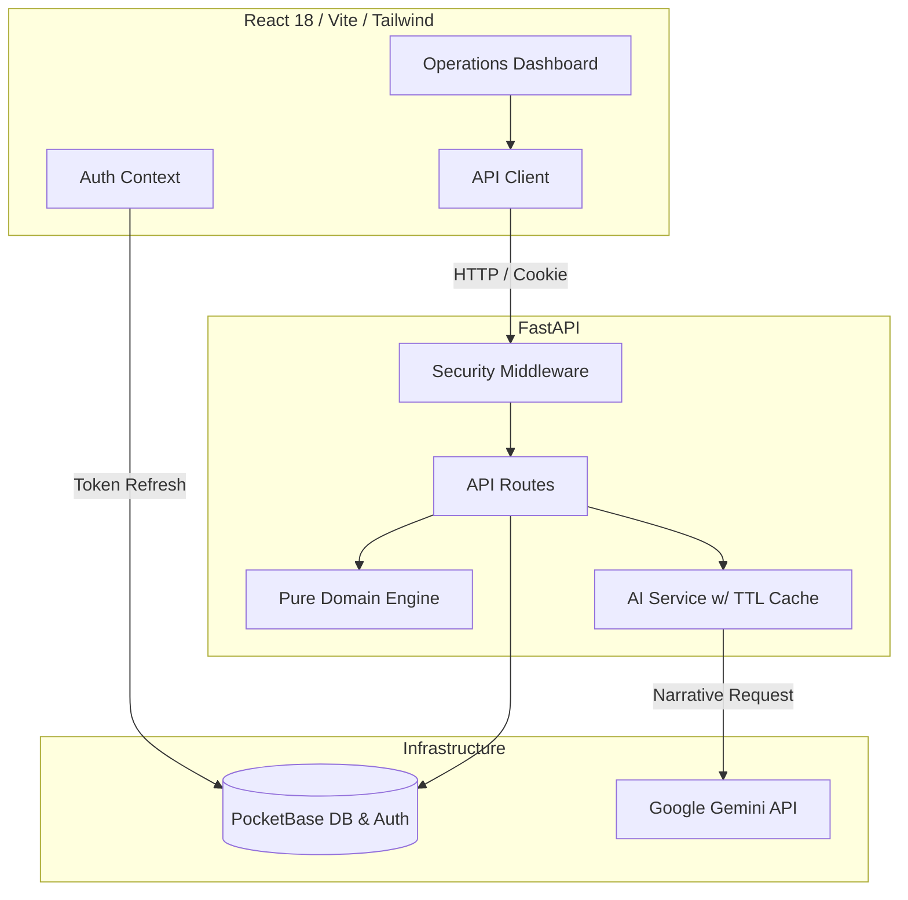

<div align="center">
  
  <h1>StadiumIQ</h1>
  <p><strong>FIFA World Cup 2026™ Stadium Operations Command Center</strong></p>
</div>

<p align="center">
  <a href="https://github.com/Harshit-925/StadiumIQ/actions/workflows/ci.yml">
    
  </a>
  <a href="https://github.com/Harshit-925/StadiumIQ/blob/main/LICENSE">
    
  </a>
  
  
</p>

---

## Documentation

For deep-dives into the engineering standards and compliance matrices behind this project, refer to the following documents:
- [Security Architecture](SECURITY_ARCHITECTURE.md)
- [Testing Strategy](TESTING_STRATEGY.md)
- [Accessibility Compliance Report](ACCESSIBILITY_COMPLIANCE_REPORT.md)
- [Code Quality Standards](CODE_QUALITY_STANDARDS.md)
- [Performance Report](PERFORMANCE_REPORT.md)

## Architecture

```text
┌────────────────────────────────────────────────────────┐
│                      FRONTEND                          │
│  React 18 + TypeScript Strict + Vite + TailwindCSS     │
│  State: Zustand | Charts: Recharts | 3D: Three.js      │
└──────────────────────────┬─────────────────────────────┘
                           │ HTTPS / REST API
┌──────────────────────────▼─────────────────────────────┐
│                      BACKEND                           │
│  FastAPI + Python 3.11 + Pydantic v2                   │
│  Engine: Pure Functions | AI: Google GenAI (Gemini)    │
└──────────────────────────┬─────────────────────────────┘
                           │
┌──────────────────────────▼─────────────────────────────┐
│                   INFRASTRUCTURE                       │
│  Auth & DB: PocketBase | Caching & Rate Limits: Redis  │
└────────────────────────────────────────────────────────┘
```



## Features

| Category | Feature | Description |
|---|---|---|
| **Crowd Safety Engine** | Real-time Density Heatmaps | Calculates pax/m² across zones to trigger dynamic safe/moderate/warning/critical states. |
| **Evacuation Modeling** | Egress Time Projection | Uses NFPA 101 formulas based on dynamic capacities and exit widths to verify the 8-minute standard. |
| **Accessibility Compliance** | ADA Seat Verification | Monitors compliance of wheelchair-accessible seating inventory against the 1% ADA mandate. |
| **Sustainability Tracking** | Waste Diversion Analytics | Tracks and evaluates diversion rates against the World Cup 2026 sustainability target of 90%. |
| **Multilingual Fan Assistant** | AI Contextual Q&A | An unauthenticated, rate-limited portal allowing fans to query stadium rules and facilities in multiple languages. |
| **AI Narration Layer** | Automatic Operator Briefings | Converts numerical engine data into conversational executive summaries for stadium directors. |
| **Security** | Zero-JS Tokens | Ensures authentication tokens are stored via `HttpOnly`, `Secure`, `SameSite=Strict` cookies, completely blocking XSS token theft. |
| **Testing & CI** | Security Audits & Coverage | Features strict CI/CD with `pip-audit`, `npm audit`, `mypy --strict`, and boundary testing. |

## Data Entities

| Entity | Primary Role | Key Fields |
|---|---|---|
| `users` (PocketBase built-in) | Operator authentication | `id`, `email`, `passwordHash`, `name` |
| `venues` | Core static stadium data | `id`, `name`, `capacity`, `exit_width_m`, `wheelchair_seats` |
| `analysis_results` | Snapshot of engine evaluations | `venue_id`, `crowd_score`, `readiness_grade`, `timestamp` |
| `fan_queries` (Logs) | Ephemeral AI query tracking | `query_text`, `language`, `source`, `fallback_used` |

## API Documentation

| Category | Method | Endpoint | Description | Auth Required |
|---|---|---|---|:---:|
| **Health** | `GET` | `/api/health` | Service connectivity check (Backend + PocketBase). | ❌ |
| **Analysis** | `POST` | `/api/analyze` | Runs pure-function engine and generates AI insights. | ✅ |
| **Fan Assistance** | `POST` | `/api/fan-assist` | Multilingual AI stadium guide with venue context. | ❌ |
| **Auth** | `POST` | `/api/auth/login` | Validates credentials and sets `HttpOnly` cookie. | ❌ |
| **Auth** | `POST` | `/api/auth/logout` | Clears `HttpOnly` session cookie via max-age expiry. | ❌ |

## Calculation Methodology

Formulas from the core domain engine (`calculator.py`):

| Metric | Formula / Calculation | Threshold / Target |
|---|---|---|
| **Crowd Density** | `spectator_count / zone_area_sqm` | Safe: < 2.0 pax/m², Critical: > 4.5 pax/m² |
| **Evacuation Time** | `(capacity / (exit_width_m * 82)) + 2.0` | Max: 8.0 minutes (NFPA 101 proxy) |
| **ADA Compliance** | `wheelchair_seats / total_capacity` | Min: 1.0% (0.01) |
| **Waste Diversion** | `(recycled_kg / total_waste_kg) * 100` | Target: 90% |

## Security Features

*   **No Hand-Rolled Auth**: Delegated completely to PocketBase's robust internal identity system.
*   **XSS Protection via Strict Cookies**: Auth tokens are stored strictly as `HttpOnly; Secure; SameSite=Strict` cookies and are never exposed to `localStorage` or `sessionStorage`.
*   **Dual Rate Limiting**:
    *   `/api/analyze` (Authenticated): 10 requests per minute by token prefix.
    *   `/api/fan-assist` (Public/Anonymous): 5 requests per minute by IP address.
*   **Automated Dependency Audits**: CI pipeline integrates `pip-audit` and `npm audit --audit-level=high` to immediately flag vulnerabilities.
*   **Secrets Scanning**: `gitleaks` configured in CI to prevent accidental credential exposure.

## Accessibility Features

*   **Never-Color-Alone Indicators**: All status markers (safe, critical, etc.) use descriptive text and distinct icons alongside their color states.
*   **Keyboard Navigation**: Full tab-index support, focus rings, and skip links available across operator dashboards.
*   **Aria-Live Regions**: Real-time alerts and dynamic changes (like AI text generation) are announced to screen readers.
*   **Reduced-Motion Support**: Continuous animations like the Stadium Pulse automatically detect system preferences and disable animation.
*   **Labeled Form Inputs**: Every input element provides an explicit, associated `<label>` for assistive tech.

## Getting Started

### Prerequisites
*   Node.js 20+
*   Python 3.11+
*   Docker & Docker Compose

### Installation
```bash
# 1. Clone the repository
git clone https://github.com/Harshit-925/StadiumIQ.git
cd StadiumIQ

# 2. Build and start the complete stack via Docker Compose
docker compose up --build -d
```

The application will be available at:
*   Frontend: `http://localhost:8000`
*   Backend API: `http://localhost:8000/api`
*   PocketBase Admin: `http://localhost:8090/_/`

### Environment Variables
Configure your `.env` file in the project root:

```env
GEMINI_API_KEY=your_key_here
ENVIRONMENT=development
USE_AI=true
RATE_LIMIT_STORAGE_URI=memory://
POCKETBASE_URL=http://localhost:8090
```

## Testing

Run the testing suites to verify domain engine behavior, auth token boundaries, and UI accessibility:

```bash
# Backend (Pytest + Coverage)
cd backend
pip install -r requirements.txt
pytest --cov=app

# Frontend (Vitest + React Testing Library)
cd frontend
npm ci --ignore-scripts
npm run test
```

**Coverage Areas:**
*   Pure deterministic edge-case testing for the `calculator.py` operations engine.
*   Auth router tests specifically asserting the presence of `HttpOnly` and `SameSite` cookie flags.
*   AI Service fallback simulations when Google GenAI is unavailable.
*   UI rendering states, accessibility properties, and protected layout routing.

## Project Structure

```text
C:.
├───backend
│   ├───app
│   │   ├───core
│   │   ├───engine
│   │   ├───models
│   │   ├───routes
│   │   └───services
│   ├───tests
│   ├───requirements.txt
│   └───pyproject.toml
├───frontend
│   ├───src
│   │   ├───components
│   │   ├───store
│   │   └───types
│   ├───tests
│   ├───package.json
│   ├───tailwind.config.js
│   └───eslint.config.js
└───pb_migrations
```

## License

This project is licensed under the [MIT License](LICENSE).

---

A unified digital command layer ensuring safe, efficient, and accessible stadium operations.
